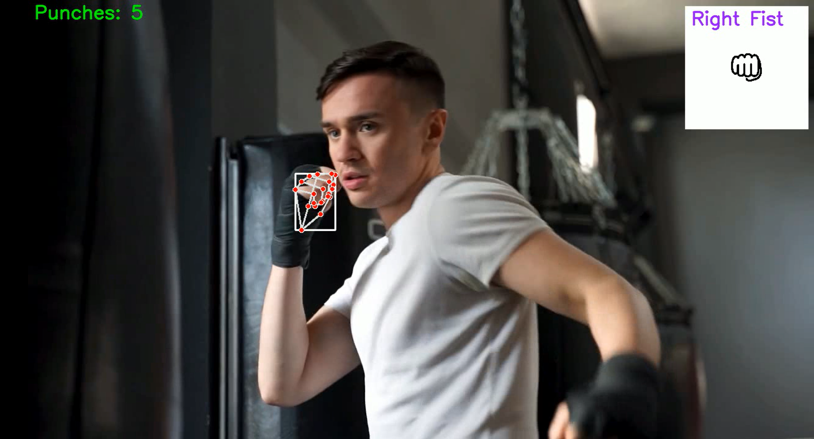

# BoxingWithML
Fists detection with punch counting for boxing. 

This project uses Mediapipe and OpenCV to detect hand movements, specifically fist punches, from a video feed. It determines the handedness (left or right) of the detected fist and counts the number of punches. Additionally, it provides a visual overlay indicating the detection and counts the punches with a delay to avoid multiple counts for the same punch.

Features
Hand Detection: Uses Mediapipe for detecting hands in the video feed.
Fist Detection: Identifies when a hand forms a fist.
Handedness Determination: Determines if the detected fist is from the left or right hand.
Punch Counting: Counts punches with a delay mechanism to ensure accurate counting.
Visual Feedback: Displays an overlay box and fist image on the video feed when a fist is detected.



## Requirements

````
pip install -r requirements.txt
````


